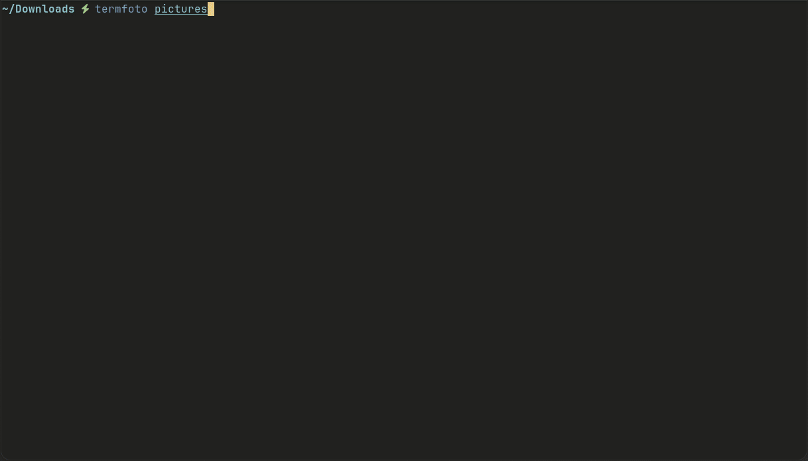

[English](README.md)

# termfoto

> 像终端一样快地浏览图片。

[](https://github.com/raconworks/termfoto/actions/workflows/ci.yml)
[](https://crates.io/crates/termfoto)
[](https://crates.io/crates/termfoto)
[](https://www.npmjs.com/package/termfoto)
[](LICENSE)



## ✨ 特性

| | |
|---|---|
| 🎨 **chafa 高质量渲染** | Unicode 字符 + true color 半块，比 sixel 清晰一个量级 |
| ⚡ **零阻塞异步加载** | 图片解码和 chafa 编码全在后台线程，滚动丝滑不卡 UI |
| 🖼 **原图尺寸全屏** | 不缩放、不失真，像素级精确居中显示 |
| ⌨ **纯键盘操作** | Vim 式导航，手不离键盘，操作即响应 |
| 🪶 **极致轻量** | 无 GUI 框架，核心依赖仅 4 个 crate |
| 📂 **即时启动** | 不建索引、不扫子目录、不缓存元数据，打开即浏览 |

## 🎯 设计哲学

**做一件事，做到极致。** termfoto 不做幻灯片、不做批量导出、不做滤镜调整。它只做一件事——用最快的方式让你在终端里看清图片。

- **主线程永不阻塞** — 所有 I/O 和编码都在后台线程执行
- **终端原生体验** — 就像 `ls` 或 `vim`，启动瞬间，操作即时
- **功能克制** — 每考虑一个新功能，先问"它会让浏览变慢吗？"

## 🤔 为什么不用其他工具？

| 工具 | 定位 | termfoto 差异 |
|------|------|-------------|
| [`viu`](https://github.com/atanunq/viu) | 单图预览 | 目录浏览 + 键盘导航 + 全屏 |
| [`timg`](https://github.com/hzeller/timg) | 图片/视频播放 | 专注图片，启动更快更轻 |
| [`ranger`](https://github.com/ranger/ranger) / [`lf`](https://github.com/gokcehan/lf) | 文件管理器 | 图片优先，交互浏览 |

## 📦 安装

**默认零依赖。** termfoto 使用终端内置协议（sixel/kitty）或 halfblocks 渲染，无需安装任何系统包。

> 💡 **想要更好的画质？** 安装 chafa 支持：`cargo install termfoto --features chafa`（需要 `libchafa-dev`）。预编译二进制已静态链接 chafa——下载即用，无需依赖。

### npm

```bash
npm install -g termfoto
```

### Cargo

```bash
cargo install termfoto
```

### 预编译二进制

从 [Releases](https://github.com/raconworks/termfoto/releases) 下载二进制，放到 `PATH` 中：

```bash
chmod +x termfoto
sudo cp termfoto /usr/local/bin/
```

### .deb 包（Debian/Ubuntu）

```bash
curl -LO https://github.com/raconworks/termfoto/releases/latest/download/termfoto_latest_amd64.deb
sudo apt install ./termfoto_latest_amd64.deb
```

### 从源码编译

```bash
git clone https://github.com/raconworks/termfoto.git
cd termfoto
cargo build --release
ln -s $(pwd)/target/release/termfoto ~/.local/bin/termfoto
```

> 💡 **创建别名：** 在 `~/.bashrc` 或 `~/.config/fish/config.fish` 中添加 `alias dr='termfoto'`。

## 🚀 使用

```bash
termfoto                 # 浏览当前目录
termfoto ~/图片           # 浏览指定目录
termfoto photo.jpg       # 直接打开单张图片（全屏模式）
termfoto --help          # 显示所有选项
termfoto --version       # 显示版本号
```

## ⌨ 快捷键

| 模式 | 按键 | 功能 |
|------|------|------|
| 浏览器 | `←` `→` `↑` `↓` | 导航 |
| 浏览器 | `Space` · `PgDn` | 下翻页 |
| 浏览器 | `PgUp` | 上翻页 |
| 浏览器 | `Home` · `End` | 跳到首/尾 |
| 浏览器 | `Enter` | 全屏查看 |
| 浏览器 | `/` · `\` | 搜索文件名 |
| 浏览器 | `L` | 切换中/英文 |
| 浏览器 | `q` · `Ctrl+C` | 退出 |
| 搜索 | `Esc` | 取消搜索 |
| 搜索 | `Tab` · `Shift+Tab` | 上/下一个结果 |
| 搜索 | `Enter` | 全屏当前结果 |
| 全屏 | `←` `→` | 上/下一张 |
| 全屏 | `L` | 切换中/英文 |
| 全屏 | `Enter` · `Esc` · `q` | 返回浏览器 |
| 全屏 | `Ctrl+C` | 退出 |

## 🔧 技术栈

| 依赖 | 用途 |
|------|------|
| [ratatui](https://ratatui.rs) | TUI 框架 |
| [ratatui-image](https://github.com/ratatui/ratatui-image) + [chafa](https://hpjansson.org/chafa/) | 图片 → Unicode 字符渲染 |
| [image](https://github.com/image-rs/image) | 图片解码（PNG/JPEG/WebP） |

## 📜 许可证

MIT

## 🌟 喜欢 termfoto？

- ⭐ **给个 Star** — 让更多人发现它
- 🐛 **报告 Bug** — [GitHub Issues](https://github.com/raconworks/termfoto/issues)
- 💡 **建议新功能** — 先问自己：*"它会让浏览变慢吗？"*

---

📦 **也可在** [crates.io](https://crates.io/crates/termfoto) · [GitHub Releases](https://github.com/raconworks/termfoto/releases) 获取

---

用 ❤️ 由 [raconworks](https://github.com/raconworks) 打造
